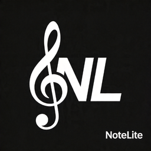
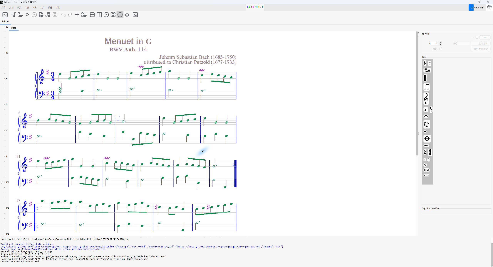

<div align="center">



# NoteLite

**Turn printed music into scores you can refine, listen to, and practice.**

Score recognition and editing · MusicXML / MIDI export · Guided practice

[](https://github.com/Lucas0623z/NoteLite/releases)
[](#build-from-source)
[](apple/README.md)
[](apple/README.md)

[Download](https://github.com/Lucas0623z/NoteLite/releases) · [Quick start](#quick-start) · [Apple clients](apple/README.md) · [Report an issue](https://github.com/Lucas0623z/NoteLite/issues)

</div>

---

NoteLite builds on the Audiveris optical music recognition engine, keeping the original desktop editor and adding a separate practice mode. Recognize a PDF or image, review and correct the score, then export MusicXML / MIDI or start playing along.

| Original desktop editor | Practice mode |
| :---: | :---: |
| [](docs/images/desktop-editor.png) | [](docs/images/practice-workspace.png) |
| Recognize, inspect, and correct the score | Follow the score, find mistakes, and review a session |

Both screenshots show the same piece, *Minuet in G major*. The original editor remains available. Open practice from the **Book** menu to launch it in a local browser window.

## Recognize, refine, and practice

| Recognition and editing | Guided practice |
| --- | --- |
| Import PDFs, scans, and sheet music images | Import MusicXML / MXL or use the current recognition result |
| Inspect and correct recognition results in the original editor | Choose an input based on the score's instrument information, with manual overrides |
| Export MusicXML, compressed MusicXML, and MIDI | Select parts, measures, and tempo for a practice session |
| Keep the complete editing workflow, with Chinese menus and toolbars available | See wrong and missing notes, review a session, and retry a passage |

Practice offers a wait mode that advances when the expected notes are played, and a tempo mode for playing in time. Score rendering and pitch detection run locally. Desktop practice opens in your browser while the editor stays available.

### Input methods

| Input | Scope |
| --- | --- |
| MIDI | MIDI-capable instruments; matches single notes and chords, and checks pitch and note onset timing |
| Microphone | One pitched voice at a time; no individual-note scoring for chords, strumming, or ensembles |
| Computer keyboard | A demo input for trying score following and note feedback |

Instrument suggestions use the score's instrument names, parts, and MIDI programs. You can select an instrument manually when that information is missing. Practice does not assess tone, pedal use, fingering, or touch. Continuous playing across real instruments still needs further validation.

If you have [PianoBooster](https://www.pianobooster.org/) installed, the desktop menu can also send it the current score or an external MIDI file. MusicXML / MXL exported by other recognition tools can be imported directly into NoteLite. These integrations use file exchange.

## Platforms

| Version | Main features | Requirements and layout |
| --- | --- | --- |
| Windows / Linux / macOS desktop | Full recognition, manual score editing, export, and practice | Java desktop editor; macOS packaging supports Apple Silicon and Intel |
| Native iPhone / iPad client | Score library, source previews, recognition jobs, practice, and session history | iOS / iPadOS 16+; phone navigation and a split view on iPad |
| Native macOS client | Score library, recognition jobs, practice, and session history | macOS 13+; SwiftUI split workspace |

Native Apple clients send PDFs and images to the [recognition bridge](bridge/README.md) you configure; they do not run the Java recognition engine on the device. Existing MusicXML files can go straight into practice. Full manual score correction remains in the desktop editor.

Apple builds are currently for development and testing, with no App Store release. Installing on a physical device or distributing a build requires your own signing setup. See the [Apple client guide](apple/README.md) and [macOS desktop packaging guide](packaging/MACOS.md).

## Quick start

### Use the desktop app

1. Download a package for your system from [Releases](https://github.com/Lucas0623z/NoteLite/releases), following that version's release notes.
2. For a ZIP distribution, extract it and run `bin/NoteLite.bat` on Windows or `bin/NoteLite` on Linux / macOS. These packages require **Java 21**. macOS installers that bundle Java do not need a separate runtime.
3. Open a PDF or sheet music image, run recognition, and review the result in the editor.
4. Export MusicXML / MIDI, or choose **Book → Instrument practice studio...**.

For a score exported by another application, choose **Book → Import external recognition result for practice...**. Distributions built from the current source also include `bin/PracticeStudio.bat` / `bin/PracticeStudio` for opening practice directly. Launch without a file to load the example score.

> Practice uses the imported score as its reference. Check recognition results before starting so a recognition error is not treated as a playing mistake. Older releases may not include features present in the current source.

### Build from source

Install **JDK 21** and point `JAVA_HOME` to it:

```sh
git clone https://github.com/Lucas0623z/NoteLite.git
cd NoteLite

# Start the original desktop editor
./gradlew :app:run --no-daemon

# Package the editor and practice launchers
./gradlew :app:distZip --no-daemon
```

Use `./gradlew.bat` on Windows. Distribution ZIPs are written to `app/build/distributions/`. If OCR language data is needed for your first recognition run, configure it in the app's language settings.

Built practice assets are included in the repository. After changing the practice interface, rebuild them with **Node.js 20+**:

```sh
cd practice-web
npm ci
npm test
npm run build
```

Native Apple clients require Xcode and XcodeGen on a Mac. Follow [apple/README.md](apple/README.md) for the full setup.

## Benchmarks and documentation

Recognition, MIDI export, and practice input are tested separately. Results from small test sets do not establish accuracy for every score or instrument.

| Guide | Contents |
| --- | --- |
| [Image / PDF to MIDI benchmark](benchmarks/omr/README.md) | Original inputs, independent references, actual recognition outputs, and reproduction steps |
| [MIDI export validation](benchmarks/midi/README.md) | Pitch, timing, and regression checks for MusicXML-to-MIDI export |
| [Practice guide and recorded instrument tests](practice-web/README.md) | Input scope, known limitations, sample sources, and test commands |
| [Apple clients](apple/README.md) | Builds, signing setup, interface tests, and physical-device validation |
| [Recognition bridge](bridge/README.md) | Running a recognition service on your computer or server |
| [macOS desktop packaging](packaging/MACOS.md) | Apple Silicon / Intel installers, signing, and notarization |

## Open-source credits and licensing

- [Audiveris](https://github.com/Audiveris/audiveris): desktop recognition and score editing. Derived source files retain AGPL-3.0-or-later notices.
- [OpenSheetMusicDisplay](https://github.com/opensheetmusicdisplay/opensheetmusicdisplay): practice score rendering.
- [Pitchy](https://github.com/ianprime0509/pitchy): single-voice pitch detection.
- [Lucide](https://lucide.dev/): practice interface icons.

This repository contains code and resources under different licenses. The root [MIT notice](LICENSE), source-file headers, upstream licenses, and [practice third-party notices](app/res/practice/THIRD-PARTY.txt) apply to their respective portions. The complete Audiveris-derived application should not be treated as MIT-only.

---

Maintained by [Yuexuan Zhang · @Lucas0623z](https://github.com/Lucas0623z). Share questions and suggestions through [Issues](https://github.com/Lucas0623z/NoteLite/issues) or [Lucas.z0623@outlook.com](mailto:Lucas.z0623@outlook.com).
